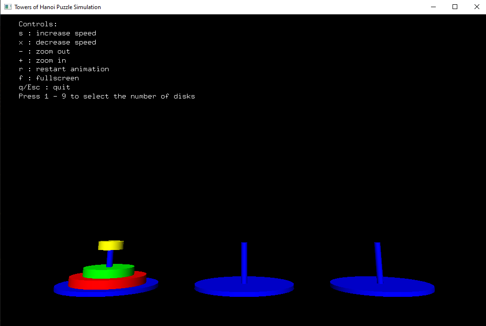

# Tower Of Hanoi Visualization

Tower of Hanoi is a mathematical puzzle where we are ptovided with three rods and n disks. The objective of the puzzle is to move the entire stack to another rod, obeying the following simple rules:

1. Only one disk can be moved at a time.
2. Each move consists of taking the upper disk from one of the stacks and placing it on top of another stack i.e. a disk can only be moved if it is the uppermost disk on a stack.
3. No disk may be placed on top of a smaller disk.

This projects visualizes the solution to the problem for a variable number of disks using the OpenGL libraries and C++.

## Project Preview

